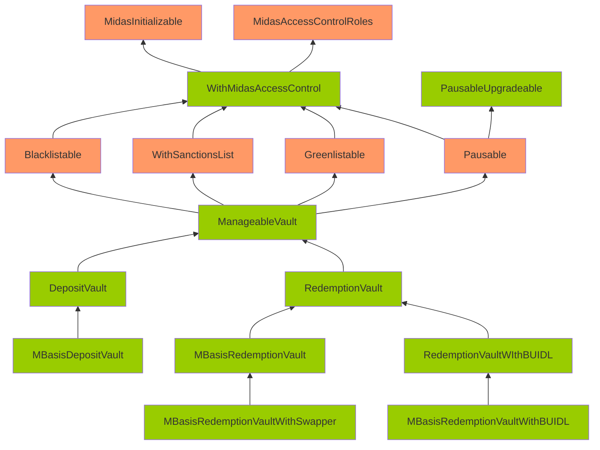

Fantastic Punch Scallop

Medium

# Vulnerable Upgradability Pattern due to lack of storage gap implementation

## Summary
Storage of upgradable contracts might be corrupted during an upgrade.
## Vulnerability Detail
Note: The contracts highlighted in Orange mean that there are no gap slots defined. The contracts highlighted in Green mean that gap slots have been defined

There gap storage has not been implemented on the Pausable/WithSanctionsList/Greenlistable that have state variables that are non-constant nor immutable.

Without gaps, adding new storage variables to any of these contracts can potentially overwrite the beginning of the storage layout of the child contract, causing critical misbehaviors in the system.

The following contracts, do have state variables that 
For `Pausable.sol`
```solidity
    mapping(bytes4 => bool) public fnPaused; //@audit mutable-variable
```
For `WithSanctionsList.sol`
```solidity
    address public sanctionsList; //@audit mutable-variable
```
For `Greenlistable.sol`
```solidity
    bool public greenlistEnabled; //@audit mutable-variable
```
## Impact
Storage of contracts highlighted green in the graph can be corrupted during an upgrade.
## Code Snippet
https://github.com/sherlock-audit/2024-08-midas-minter-redeemer/blob/52b77ba39be51f18a5b0736dfbe7f2acbbeba6e3/midas-contracts/contracts/access/Pausable.sol#L14
https://github.com/sherlock-audit/2024-08-midas-minter-redeemer/blob/52b77ba39be51f18a5b0736dfbe7f2acbbeba6e3/midas-contracts/contracts/abstract/WithSanctionsList.sol#L18
https://github.com/sherlock-audit/2024-08-midas-minter-redeemer/blob/52b77ba39be51f18a5b0736dfbe7f2acbbeba6e3/midas-contracts/contracts/access/Greenlistable.sol#L22
## Tool used

Manual Review

## Recommendation
Add gaps for contracts that has mutable state variables.