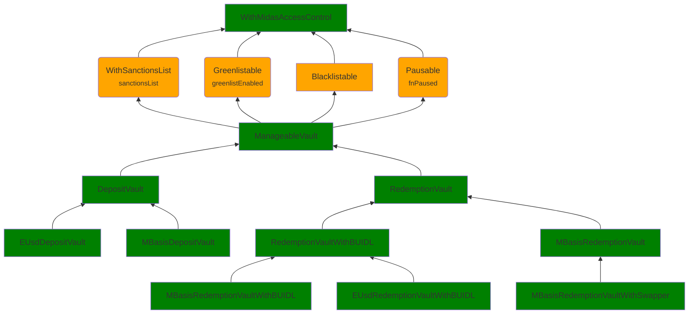

Tricky Rose Hedgehog

Medium

# [Medium] Corruptible Upgradability Pattern

## Summary

Storage of DepositVault/RedemptionVault/mBasis vaults/EUsd vaults contracts may be corrupted during an upgrade

## Vulnerability Detail

The following graph represents the inheritance of Midas's contracts. Green background means no gap slots left, orange background means that there were gap slots left. The text below the contracts' names is the storage variable defined in the contract.

DepositVault/RedemptionVault/mBasis vaults/EUsd vaults contracts are upgradeable but inherit contracts in a complex structure that are not upgrade-safe.

There is a storage gap in DepositVault, RedemptionVault, ManageableVault, WithMidasAccessControl, EUsdDepositVault MBasisDepositVault, RedemptionVaultWithBUIDL, MBasisRedemptionVaultWithBUIDL, MBasisRedemptionVault, EUsdRedemptionVaultWithBUIDL, MBasisRedemptionVaultWithSwapper.

No storage gap is defined in Pausable, Greenlistable, WithSanctionsList, which also have defined variables and should have storage gaps defined as well.

Since this is a complex inheritance structure, having no gaps in the mentioned contracts can lead to overwriting the beginning of the storage layout of a child contract when adding new storage variables to the above-mentioned contracts.

## Impact

Storage of DepositVault/RedemptionVault/mBasis vaults/EUsd vaults contracts may be corrupted during an upgrade

## Code Snippet

https://github.com/sherlock-audit/2024-08-midas-minter-redeemer/blob/main/midas-contracts/contracts/access/Greenlistable.sol#L22
https://github.com/sherlock-audit/2024-08-midas-minter-redeemer/blob/main/midas-contracts/contracts/abstract/WithSanctionsList.sol#L18
https://github.com/sherlock-audit/2024-08-midas-minter-redeemer/blob/main/midas-contracts/contracts/access/Pausable.sol#L14

## Tool used

Manual Review

## Recommendation

Add gaps in Pausable, Greenlistable, WithSanctionsList contracts.