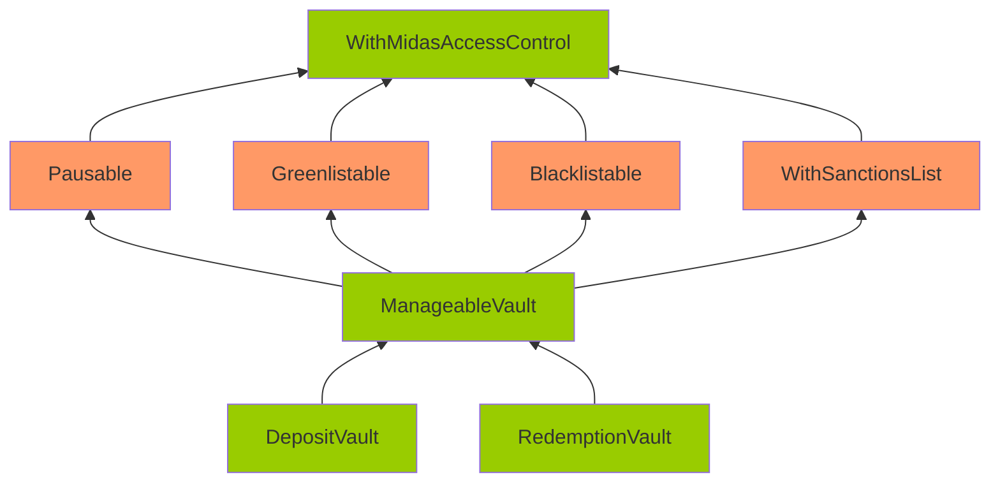

Muscular Jade Hedgehog

Medium

# Corruptible Upgradability Pattern

## Summary

Storage of vault contracts (e.g. DepositVault, RedemptionVault, ...) contracts might be corrupted during an upgrade.

## Vulnerability Detail

Following is the inheritance of the DepositVault/RedemptionVault contracts.

Note: The contracts highlighted in Orange mean that there are no gap slots defined. The contracts highlighted in Green mean that gap slots have been defined

The vault contracts are meant to be upgradeable. However, it inherits contracts that are not upgrade-safe.

The gap storage has been implemented on the DepositVault/RedemptionVault/ManageableVault/WithMidasAccessControl.

However, no gap storage is implemented on Pausable/Greenlistable/Blacklistable/WithSanctionsList. Among these contracts, Pausable/Greenlistable/WithSanctionsList are contracts with defined variables (non pure-function), and they should have gaps as well.

Without gaps, adding new storage variables to any of these contracts can potentially overwrite the beginning of the storage layout of the child contract, causing critical misbehaviors in the system.

Note that during the last sherlock audit, this was also reported as an [issue](https://github.com/sherlock-audit/2024-05-midas-judging/issues/109). It was fixed by adding gaps to the non-pure contracts. However, since that audit, new contracts and new variables are introduced, so this issue occurs again.

Also, CustomAggregatorV3CompatibleFeed does not have gaps but is inherited by MBasisCustomAggregatorFeed/MTBillCustomAggregatorFeed. If the feed wants to be upgradeable, CustomAggregatorV3CompatibleFeed should also have gaps.

## Impact

Storage of vault contracts might be corrupted during upgrading.

## Code Snippet

- https://github.com/sherlock-audit/2024-08-midas-minter-redeemer/blob/main/midas-contracts/contracts/access/Greenlistable.sol#L22
- https://github.com/sherlock-audit/2024-08-midas-minter-redeemer/blob/main/midas-contracts/contracts/access/Pausable.sol#L14
- https://github.com/sherlock-audit/2024-08-midas-minter-redeemer/blob/main/midas-contracts/contracts/abstract/WithSanctionsList.sol#L18

## Tool used

Manual review

## Recommendation

Add gaps for non pure-function contracts: Pausable/Greenlistable/WithSanctionsList/CustomAggregatorV3CompatibleFeed.