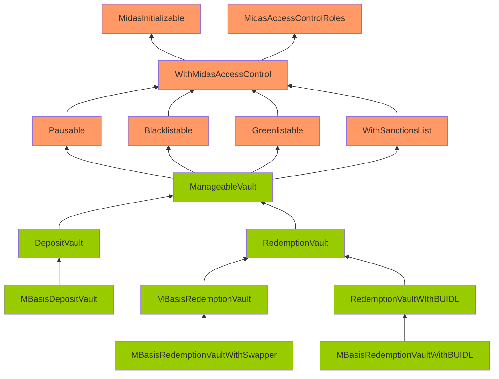
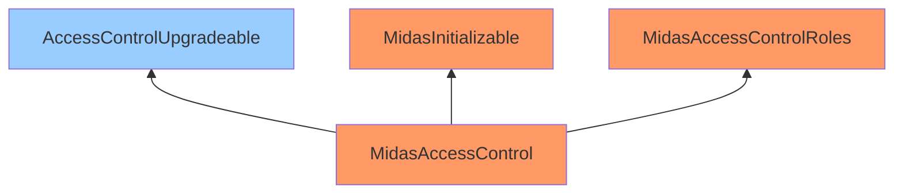
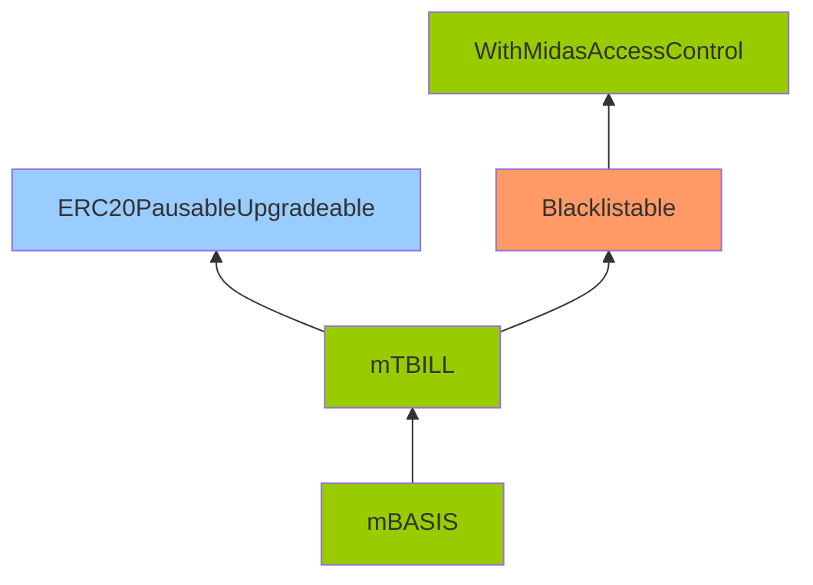
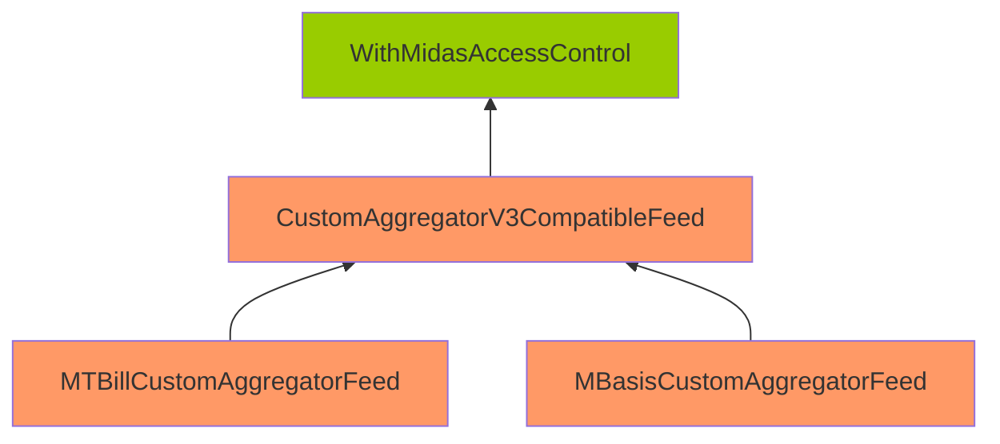

Winning Jetblack Salmon

Medium

# Corruptible upgradability pattern.

## Summary

In the Midas protocol, certain upgradeable contracts lack storage gap definitions, which could lead to storage corruption during contract upgrades.

## Vulnerability Detail

When developing upgradeable smart contracts, it's essential to maintain a consistent storage layout across contract versions to prevent storage collisions.

In the Midas protocol, several contracts inherit from base contracts that do not define these necessary storage gaps, creating a risk of storage corruption when upgrading the contracts.

Here's an analysis of the inheritance relationships among the Midas protocol contracts:

- **Contracts with No Storage Gaps** (Highlighted in Orange): These contracts lack the storage gap definition required for upgrade safety.

- **Contracts with Proper Storage Gaps** (Highlighted in Green): These contracts have defined storage gaps, making them upgrade-safe.

- **OpenZeppelin (OZ) Contracts with Proper Storage Gaps** (Highlighted in Blue): These are standard OZ contracts with proper storage gap definitions.

---

---

---

---

The `DepositVault`, `RedemptionVault`, `mTBILL`, `CustomAggregatorV3CompatibleFeed`, and `MidasAccessControl` contracts are intended to be upgradeable. However, their inherited contracts are not upgrade-safe.

The following contracts do not have storage gaps implemented:

- MidasInitializable
- MidasAccessControlRoles
- Pausable
- Blacklistable
- Greenlistable
- WithSanctionsList
- MidasAccessControl
- CustomAggregatorV3CompatibleFeed
- MTBillCustomAggregatorFeed
- MBasisCustomAggregatorFeed

Among these, only `MidasInitializable` and `MidasAccessControlRoles` do not require storage gaps, as they do not introduce new storage variables. 

However, the rest of the contracts should have storage gaps implemented to prevent storage corruption during upgrades.

## Impact

Without defined storage gaps, any new storage variables added during contract upgrades can overwrite existing storage layout slots in child contracts. This could result in severe and unpredictable behavior in the system, including data loss, incorrect logic execution, and potentially exploited vulnerabilities.

## Code Snippet

https://github.com/sherlock-audit/2024-08-midas-minter-redeemer/blob/main/midas-contracts/contracts/access/Greenlistable.sol#L22
https://github.com/sherlock-audit/2024-08-midas-minter-redeemer/blob/main/midas-contracts/contracts/access/MidasAccessControl.sol
https://github.com/sherlock-audit/2024-08-midas-minter-redeemer/blob/main/midas-contracts/contracts/access/Pausable.sol#L14
https://github.com/sherlock-audit/2024-08-midas-minter-redeemer/blob/main/midas-contracts/contracts/abstract/WithSanctionsList.sol#L18

## Tool used

Manual review.

## Recommendation

Add missing storage gaps to all contracts except `MidasInitializable` and `MidasAccessControlRoles`.

It is important to note that the size of the storage gap should be determined with already used slots in mind. This helps determine how many slots are actively used and helps navigate between contract-used storage slots when the developer knows that the contract is supposed to use the same number of slots, for example, 50.

Therefore, as an example, the `DepositVault` contract storage gap should be of size 47: `uint256[47] private __gap;`.