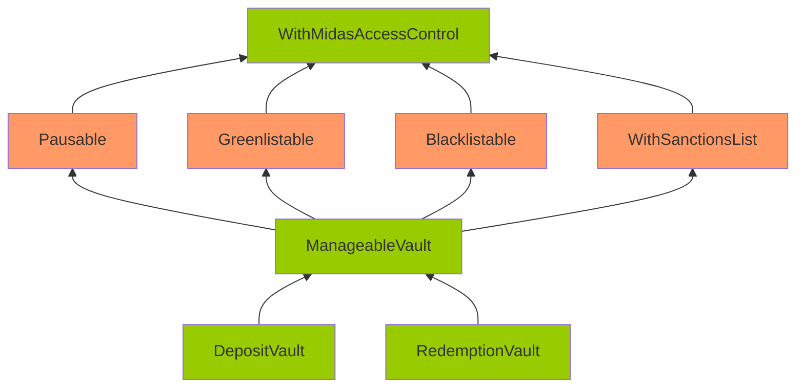

# Issue H-1: `RedemptionVaultWIthBUIDL.sol#redeemInstant` will always DoS due to incorrect contract call. 

Source: https://github.com/sherlock-audit/2024-08-midas-minter-redeemer-judging/issues/99 

## Found by 
0xNirix, 0xpiken, 4gontuk, Ironsidesec, Kirkeelee, eeyore, merlinboii, pkqs90

## Summary

`RedemptionVaultWIthBUIDL.sol#redeemInstant` will always DoS due to incorrect contract call.

## Vulnerability Detail

In `RedemptionVaultWIthBUIDL` contract, it uses the BUIDL contracts to redeem BUIDL tokens to USDC tokens, and users are expected to always receive USDC tokens.

On Ethereum, the `buidlRedemption` is this contract https://etherscan.io/address/0x31D3F59Ad4aAC0eeE2247c65EBE8Bf6E9E470a53#readContract. The `buidlRedemption.liquidity()` is this contract https://etherscan.io/address/0xA0b86991c6218b36c1d19D4a2e9Eb0cE3606eB48, which is USDC.

The issue here is, the code wrongly assumes `buidlRedemption.liquidity()` is the liquiditySource, when it should be the USDC token. This will always lead to DoS for the `buidlLiquiditySource.token()` call in `redeemInstant` since USDC does not support `.token()` call.

```solidity
    function initialize(
        address _ac,
        MTokenInitParams calldata _mTokenInitParams,
        ReceiversInitParams calldata _receiversInitParams,
        InstantInitParams calldata _instantInitParams,
        address _sanctionsList,
        uint256 _variationTolerance,
        uint256 _minAmount,
        FiatRedeptionInitParams calldata _fiatRedemptionInitParams,
        address _requestRedeemer,
        address _buidlRedemption
    ) external initializer {
        __RedemptionVault_init(
            _ac,
            _mTokenInitParams,
            _receiversInitParams,
            _instantInitParams,
            _sanctionsList,
            _variationTolerance,
            _minAmount,
            _fiatRedemptionInitParams,
            _requestRedeemer
        );
        _validateAddress(_buidlRedemption, false);
@>      buidlRedemption = IRedemption(_buidlRedemption);
        buidlSettlement = ISettlement(buidlRedemption.settlement());
@>      buidlLiquiditySource = ILiquiditySource(buidlRedemption.liquidity());
        buidl = IERC20(buidlRedemption.asset());
    }


    function redeemInstant(
        address tokenOut,
        uint256 amountMTokenIn,
        uint256 minReceiveAmount
    )
        external
        override
        whenFnNotPaused(this.redeemInstant.selector)
        onlyGreenlisted(msg.sender)
        onlyNotBlacklisted(msg.sender)
        onlyNotSanctioned(msg.sender)
    {
        // BUG: This will always fail.
@>      tokenOut = buidlLiquiditySource.token();
        ...
    }
```

The correct implementation would be to use `buidlSettlement.liquiditySource()` to get the liquidity source, since there is an API for that in the buidlSettlement contract https://etherscan.io/address/0x57Dd4E92712b0fBC8d3f3e3645EebCf2600aCef0#readContract.

## Impact

`RedemptionVaultWIthBUIDL.sol#redeemInstant` will always DoS.

## Code Snippet

- https://github.com/sherlock-audit/2024-08-midas-minter-redeemer/blob/main/midas-contracts/contracts/RedemptionVaultWithBUIDL.sol#L100

## Tool used

Manual Review

## Recommendation

Use `buidlSettlement.liquiditySource()` to get the liquidity source. Also add the `liquiditySource` API to `ISettlement`.


## Discussion

**sherlock-admin3**

1 comment(s) were left on this issue during the judging contest.

**merlinboii** commented:
> Incorrect assumption and OOS.


# Issue M-1: BUIDL redemption may fail due to minimum redemption limit, causing the redeem of `RedemptionVaultWIthBUIDL` to DoS. 

Source: https://github.com/sherlock-audit/2024-08-midas-minter-redeemer-judging/issues/98 

## Found by 
pkqs90

## Summary

BUIDL redemption may fail due to minimum redemption limit, causing the redeem of `RedemptionVaultWIthBUIDL` to DoS.

## Vulnerability Detail

According to the [specs](https://ludicrous-rate-748.notion.site/8060186191934380800b669406f4d83c?v=35634cda6b084e2191b83f295433efdf&p=927832e82a874221996c1edcc1d94b17&pm=s), there is a 250k minimum redemption limit for BUIDL tokens.

> Redeem the full BUIDL balance in the smartcontract if the BUIDL balance will be less than 250k post transaction (as 250k is the minimum).
Make this 250k threshold a parameter that can be adjusted by the admin

The limit is also documented here: https://www.steakhouse.financial/projects/blackrock-buidl.

> However, shares cannot be sold back unless their total value is at least $250,000, or if an exception is granted. 

The issue is that when trying to redeem BUIDL token, the current implementation only redeems the amount required for this transaction, and it may very well be below minimum redemption limit, and would cause DoS. Example:

0. There are 60k USDC and 1M BUIDL tokens in the contract in the beginning.
1. User redeems 100k mToken, which is worth 100k USDC (ignoring fees for simplicity).
2. Since there are 60k USDC left in contract, the contract tries to redeem 100k - 60k = 40k BUIDL to USDC.

However, since there is a 250k minimum redemption limit, the redeem would fail.

The correct implementation should be to redeem 250k BUIDL, and transfer 100k USDC to user. In the end, there should be 60k + 250k - 100k = 210k USDC and 1M - 250k = 750k BUIDL left in the contract.

```solidity
    function redeemInstant(
        address tokenOut,
        uint256 amountMTokenIn,
        uint256 minReceiveAmount
    )
        external
        override
        whenFnNotPaused(this.redeemInstant.selector)
        onlyGreenlisted(msg.sender)
        onlyNotBlacklisted(msg.sender)
        onlyNotSanctioned(msg.sender)
    {
        ...
        _checkAndRedeemBUIDL(tokenOutCopy, amountTokenOutWithoutFeeFrom18);
        ...
    }

    function _checkAndRedeemBUIDL(address tokenOut, uint256 amountTokenOut)
        internal
    {
        uint256 contractBalanceTokenOut = IERC20(tokenOut).balanceOf(
            address(this)
        );
        if (contractBalanceTokenOut >= amountTokenOut) return;

        uint256 buidlToRedeem = amountTokenOut - contractBalanceTokenOut;

        buidl.safeIncreaseAllowance(address(buidlRedemption), buidlToRedeem);

        // BUG: buidlToRedeem may be smaller than 250k redemption limit.
@>      buidlRedemption.redeem(buidlToRedeem);
    }
```

## Impact

Redeeming mToken in `RedemptionVaultWIthBUIDL` may DoS.

## Code Snippet

- https://github.com/sherlock-audit/2024-08-midas-minter-redeemer/blob/main/midas-contracts/contracts/RedemptionVaultWithBUIDL.sol#L164-L176

## Tool used

Manual Review

## Recommendation

If the required amount of USDC is less than minimum redemption limit (250k), redeem up to the minimum redemption limit to avoid DoS.


## Discussion

**sherlock-admin2**

1 comment(s) were left on this issue during the judging contest.

**merlinboii** commented:
> Duplicate of 121.


# Issue M-2: RedemptionVaultWIthBUIDL does not redeem full balance if BUIDL balance is less than 250k post transaction. 

Source: https://github.com/sherlock-audit/2024-08-midas-minter-redeemer-judging/issues/100 

## Found by 
0xadrii, 0xpiken, Drynooo, Hunter, Ironsidesec, NoOneWinner, WildSniper, eeyore, pkqs90, rzizah

## Summary

RedemptionVaultWIthBUIDL does not redeem full balance if BUIDL balance is less than 250k post transaction.

## Vulnerability Detail

According to the [specs](https://ludicrous-rate-748.notion.site/8060186191934380800b669406f4d83c?v=35634cda6b084e2191b83f295433efdf&p=927832e82a874221996c1edcc1d94b17&pm=s), there should be a feature that when redeeming BUIDL tokens, it should redeem full balance if the remaining BUIDL tokens is less than 250k. However, no such feature is implemented.

> Redeem the full BUIDL balance in the smartcontract if the BUIDL balance will be less than 250k post transaction (as 250k is the minimum).
Make this 250k threshold a parameter that can be adjusted by the admin

Contest readme states that "Please note that discrepancies between the spec and the code can be reported as issues", thus reporting this as a medium severity issue.

Also, note that this feature is required because BUIDL token has a minimum redemption limit of 250k (according to https://www.steakhouse.financial/projects/blackrock-buidl). Thus lack of this feature may result in lock of BUIDL tokens within the RedemptionVaultWIthBUIDL contract.

> However, shares cannot be sold back unless their total value is at least $250,000, or if an exception is granted. 

```solidity
    function _checkAndRedeemBUIDL(address tokenOut, uint256 amountTokenOut)
        internal
    {
        uint256 contractBalanceTokenOut = IERC20(tokenOut).balanceOf(
            address(this)
        );
        if (contractBalanceTokenOut >= amountTokenOut) return;

        uint256 buidlToRedeem = amountTokenOut - contractBalanceTokenOut;

        buidl.safeIncreaseAllowance(address(buidlRedemption), buidlToRedeem);
        buidlRedemption.redeem(buidlToRedeem);
    }
```

## Impact

1. Lock of BUIDL token in RedemptionVaultWIthBUIDL contract.
2. Discrepancy between spec and code.

## Code Snippet

- https://github.com/sherlock-audit/2024-08-midas-minter-redeemer/blob/main/midas-contracts/contracts/RedemptionVaultWithBUIDL.sol#L164-L176

## Tool used

Manual Review

## Recommendation

Implement such feature.

# Issue M-3: Corruptible Upgradability Pattern 

Source: https://github.com/sherlock-audit/2024-08-midas-minter-redeemer-judging/issues/103 

## Found by 
0xadrii, Hunter, NoOneWinner, WildSniper, aslanbek, eeshenggoh, eeyore, pandasec, pkqs90

## Summary

Storage of vault contracts (e.g. DepositVault, RedemptionVault, ...) contracts might be corrupted during an upgrade.

## Vulnerability Detail

Following is the inheritance of the DepositVault/RedemptionVault contracts.

Note: The contracts highlighted in Orange mean that there are no gap slots defined. The contracts highlighted in Green mean that gap slots have been defined



The vault contracts are meant to be upgradeable. However, it inherits contracts that are not upgrade-safe.

The gap storage has been implemented on the DepositVault/RedemptionVault/ManageableVault/WithMidasAccessControl.

However, no gap storage is implemented on Pausable/Greenlistable/Blacklistable/WithSanctionsList. Among these contracts, Pausable/Greenlistable/WithSanctionsList are contracts with defined variables (non pure-function), and they should have gaps as well.

Without gaps, adding new storage variables to any of these contracts can potentially overwrite the beginning of the storage layout of the child contract, causing critical misbehaviors in the system.

Note that during the last sherlock audit, this was also reported as an [issue](https://github.com/sherlock-audit/2024-05-midas-judging/issues/109). It was fixed by adding gaps to the non-pure contracts. However, since that audit, new contracts and new variables are introduced, so this issue occurs again.

Also, CustomAggregatorV3CompatibleFeed does not have gaps but is inherited by MBasisCustomAggregatorFeed/MTBillCustomAggregatorFeed. If the feed wants to be upgradeable, CustomAggregatorV3CompatibleFeed should also have gaps.

## Impact

Storage of vault contracts might be corrupted during upgrading.

## Code Snippet

- https://github.com/sherlock-audit/2024-08-midas-minter-redeemer/blob/main/midas-contracts/contracts/access/Greenlistable.sol#L22
- https://github.com/sherlock-audit/2024-08-midas-minter-redeemer/blob/main/midas-contracts/contracts/access/Pausable.sol#L14
- https://github.com/sherlock-audit/2024-08-midas-minter-redeemer/blob/main/midas-contracts/contracts/abstract/WithSanctionsList.sol#L18

## Tool used

Manual review

## Recommendation

Add gaps for non pure-function contracts: Pausable/Greenlistable/WithSanctionsList/CustomAggregatorV3CompatibleFeed.


## Discussion

**sherlock-admin2**

1 comment(s) were left on this issue during the judging contest.

**merlinboii** commented:
> Known Issue from the past audit contest and as the past issue there is no gap for several functions and the platform should to fix with the contract that they is decided to more potential to be changes. Assume that it is known issue and sponspor intended to design which contracts that they shoul introduce the gap.


# Issue M-4: No slippage parameter for standard deposit request. 

Source: https://github.com/sherlock-audit/2024-08-midas-minter-redeemer-judging/issues/104 

## Found by 
0xBugHunter, Breeje, Cyphermonk, Ironsidesec, blockchain555, meltedblocks, novaman33, pkqs90

## Summary

No slippage parameter for standard deposit request. Users may receive less mTokens than they expect.

## Vulnerability Detail

When users are depositing tokens to acquire mTokens, there are two paths: 1) instant deposit, 2) standard deposit.

- During instant deposit, users will receive mTokens immediately, based on the inToken and mToken rate at the time.
- During standard deposit, users will need to wait for admins to approve the request.

Users may fallback to using a standard deposit if the daily limit is hit for instant deposit.

The issue here is that there is a slippage parameter limiting the amount of mTokens users receive for instant deposit, but not for standard deposit. This is an issue, especially considering the tokenIn rate is calculated during the deposit request transaction, and that there is no slippage parameter to control it. Example:

1. User calls `depositRequest()` to deposit WBTC for mToken.
2. The deposit transaction takes a while to process, and WBTC price crashes during the time (and recovers later).
3. The transaction is processed, but the `tokenInRate` is now much lower than when the user initiated the deposit. This will lead to users receiving less mToken in the end.

During the process, there is no mechanism for user to set a slippage parameter nor cancel the request.

Note that the specs did not mention slippage is required for standard deposit. However, this doesn't mean it doesn't pose a vulnerability.

```solidity
    function depositRequest(
        address tokenIn,
        uint256 amountToken,
        bytes32 referrerId
    )
        external
        whenFnNotPaused(this.depositRequest.selector)
        onlyGreenlisted(msg.sender)
        onlyNotBlacklisted(msg.sender)
        onlyNotSanctioned(msg.sender)
        returns (uint256 requestId)
    {
        address user = msg.sender;

        address tokenInCopy = tokenIn;
        uint256 amountTokenCopy = amountToken;
        bytes32 referrerIdCopy = referrerId;

        uint256 currentId = currentRequestId.current();
        requestId = currentId;
        currentRequestId.increment();

        (
            uint256 tokenAmountInUsd,
            uint256 feeAmount,
            uint256 amountTokenWithoutFee,
            ,
@>          uint256 tokenInRate,
            uint256 tokenOutRate,
            uint256 tokenDecimals
        ) = _calcAndValidateDeposit(user, tokenInCopy, amountTokenCopy, false);

        _tokenTransferFromUser(
            tokenInCopy,
            tokensReceiver,
            amountTokenWithoutFee,
            tokenDecimals
        );

        if (feeAmount > 0)
            _tokenTransferFromUser(
                tokenInCopy,
                feeReceiver,
                feeAmount,
                tokenDecimals
            );

        mintRequests[currentId] = Request({
            sender: user,
            tokenIn: tokenInCopy,
            status: RequestStatus.Pending,
            depositedUsdAmount: tokenAmountInUsd,
@>          usdAmountWithoutFees: (amountTokenWithoutFee * tokenInRate) /
                10**18,
            tokenOutRate: tokenOutRate
        });

        emit DepositRequest(
            currentId,
            user,
            tokenInCopy,
            tokenAmountInUsd,
            feeAmount,
            tokenOutRate,
            referrerIdCopy
        );
    }
```

## Impact

Users may receive less mTokens than they expect.

## Code Snippet

- https://github.com/sherlock-audit/2024-08-midas-minter-redeemer/blob/main/midas-contracts/contracts/DepositVault.sol#L148

## Tool used

Manual Review

## Recommendation

Also add a slippage parameter for standard deposits to limit the minimum amount of mToken received.

When admins approve the deposit request, check the amount of mTokens against the number. If it is impossible to fulfill the request, the admin can just reject the request.


## Discussion

**sherlock-admin4**

1 comment(s) were left on this issue during the judging contest.

**merlinboii** commented:
> Duplicate of 124


# Issue M-5: MBasisRedemptionVaultWithSwapper does not update mBasis daily limit or allowance when conducting mBasis->mTBill swap. 

Source: https://github.com/sherlock-audit/2024-08-midas-minter-redeemer-judging/issues/110 

## Found by 
eeyore, pkqs90

## Summary

MBasisRedemptionVaultWithSwapper does not update mBasis daily limit or allowance when conducting mBasis->mTBill swap.

## Vulnerability Detail

When users are redeeming from `MBasisRedemptionVaultWithSwapper`, if there is not enough `tokenOut` balance, it will first conduct a mBasis->mTBill swap and try to redeem from the mTBill redemption vault.

The issue here is, when this happens, the daily limit and token allowance is only deducted from the mTBill redemption vault, and not the original `MBasisRedemptionVaultWithSwapper` contract.

```solidity
    function redeemInstant(
        address tokenOut,
        uint256 amountMTokenIn,
        uint256 minReceiveAmount
    )
        external
        override(IRedemptionVault, RedemptionVault)
        whenFnNotPaused(this.redeemInstant.selector)
        onlyGreenlisted(msg.sender)
        onlyNotBlacklisted(msg.sender)
        onlyNotSanctioned(msg.sender)
    {
        ...
        uint256 contractTokenOutBalance = IERC20(tokenOutCopy).balanceOf(
            address(this)
        );

        if (
            contractTokenOutBalance >=
            amountTokenOutWithoutFee.convertFromBase18(tokenDecimals)
        ) {
@>          _requireAndUpdateLimit(amountMTokenInCopy);
            _requireAndUpdateAllowance(tokenOutCopy, amountTokenOut);

            mToken.burn(user, amountMTokenWithoutFee);
        } else {
            uint256 mTbillAmount = _swapMBasisToMToken(amountMTokenWithoutFee);

            IERC20(mTbillRedemptionVault.mToken()).safeIncreaseAllowance(
                address(mTbillRedemptionVault),
                mTbillAmount
            );

            mTbillRedemptionVault.redeemInstant(
                tokenOutCopy,
                mTbillAmount,
                minReceiveAmountCopy
            );

            uint256 contractTokenOutBalanceAfterRedeem = IERC20(tokenOutCopy)
                .balanceOf(address(this));
            amountTokenOutWithoutFee = (contractTokenOutBalanceAfterRedeem -
                contractTokenOutBalance).convertToBase18(tokenDecimals);
        }

        _tokenTransferToUser(
            tokenOutCopy,
            user,
            amountTokenOutWithoutFee,
            tokenDecimals
        );

        emit RedeemInstant(
            user,
            tokenOutCopy,
            amountMTokenInCopy,
            feeAmount,
            amountTokenOutWithoutFee
        );
    }
```

## Impact

mBasis daily limit and token allowance does not deduct as expected.

## Code Snippet

- https://github.com/sherlock-audit/2024-08-midas-minter-redeemer/blob/main/midas-contracts/contracts/mBasis/MBasisRedemptionVaultWithSwapper.sol#L146-L164

## Tool used

Manual Review

## Recommendation

Also update mBasis daily limit and allowance when conducting mBasis->mTBill swap for `MBasisRedemptionVaultWithSwapper`.


## Discussion

**sherlock-admin2**

1 comment(s) were left on this issue during the judging contest.

**merlinboii** commented:
> Incorrect assumption and Intended design. For the swapper flow: the mToken limit is tracked in the vault that PROVIDE THE REAL REDEMPTION so for this case their is no token operate with the main vault but it operate redeem inside the mTBILL vault. The issue suggestion will prevent the user from redeemInstant with enough tokenOut as the limit is over updated by the amount of token that does not operate inside them.


# Issue M-6: Discrepancy between spec and code: Vault admin cannot update `tokensReceiver`. 

Source: https://github.com/sherlock-audit/2024-08-midas-minter-redeemer-judging/issues/111 

## Found by 
0xpiken, pashap9990, pkqs90

## Summary

Vault admin cannot update `tokensReceiver`. However, the specs claim that admin should be able to update it.

## Vulnerability Detail

In the [specs](https://ludicrous-rate-748.notion.site/8060186191934380800b669406f4d83c?v=35634cda6b084e2191b83f295433efdf&p=42afde9e098b42ef8296e43286b73299&pm=s), we can see that the "Investment recipient address" is an address the admin can set and **adjust**.

> This is the list of parameters that the admin can set and adjust

> Investment recipient address

> This is the address that receives the funds sent by investors when requesting a subscription (either instant or standard)

However, the `tokensReceiver` variable can only be set during the initializer, and there is no set function for it. Note that all other variables listed in the spec has a setter function, except for `tokensReceiver`.

This is a discrepancy between code and specs where the admin does not have the ability to update the investment recipient address as expected.

```solidity
    /**
     * @notice address to which tokens and mTokens will be sent
     */
    address public tokensReceiver;

    function __ManageableVault_init(
        address _ac,
        MTokenInitParams calldata _mTokenInitParams,
        ReceiversInitParams calldata _receiversInitParams,
        InstantInitParams calldata _instantInitParams,
        address _sanctionsList,
        uint256 _variationTolerance,
        uint256 _minAmount
    ) internal onlyInitializing {
        _validateAddress(_mTokenInitParams.mToken, false);
        _validateAddress(_mTokenInitParams.mTokenDataFeed, false);
@>      _validateAddress(_receiversInitParams.tokensReceiver, true);
        _validateAddress(_receiversInitParams.feeReceiver, true);
        require(_instantInitParams.instantDailyLimit > 0, "zero limit");
        _validateFee(_variationTolerance, true);
        _validateFee(_instantInitParams.instantFee, false);

        mToken = IMTbill(_mTokenInitParams.mToken);
        __Pausable_init(_ac);
        __Greenlistable_init_unchained();
        __Blacklistable_init_unchained();
        __WithSanctionsList_init_unchained(_sanctionsList);

@>      tokensReceiver = _receiversInitParams.tokensReceiver;
        feeReceiver = _receiversInitParams.feeReceiver;
        instantFee = _instantInitParams.instantFee;
        instantDailyLimit = _instantInitParams.instantDailyLimit;
        minAmount = _minAmount;
        variationTolerance = _variationTolerance;
        mTokenDataFeed = IDataFeed(_mTokenInitParams.mTokenDataFeed);
    }
```

## Impact

1. Admin cannot set `tokensReceiver` after contract initialization.
2. Discrepancy between spec and code.

## Code Snippet

- https://github.com/sherlock-audit/2024-08-midas-minter-redeemer/blob/main/midas-contracts/contracts/abstract/ManageableVault.sol#L76

## Tool used

Manual Review

## Recommendation

Create a setter function for `tokensReceiver`.


## Discussion

**sherlock-admin4**

1 comment(s) were left on this issue during the judging contest.

**merlinboii** commented:
> The issue describes the discrepency of the spec from notion side that can be treated as the source of truth. Admin should able to `set` and `adjust` the list of parameters here: https://ludicrous-rate-748.notion.site/Admin-can-adjust-Global-Parameters-42afde9e098b42ef8296e43286b73299 so conflict with the code `Issues that break these statements irrespective of whether the impact is low/unknown will be assigned Medium severity`


