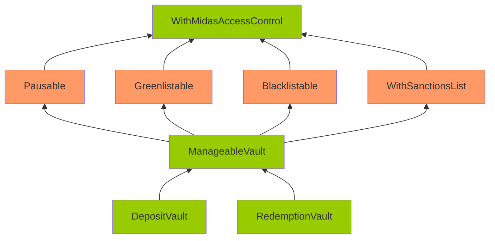

# Issue M-1: `RedemptionVaultWIthBUIDL.sol#redeemInstant` will always DoS due to incorrect contract call. 

Source: https://github.com/sherlock-audit/2024-08-midas-minter-redeemer-judging/issues/99 

## Found by 
0xpiken, Ironsidesec, Kirkeelee, eeyore, pkqs90

## Summary

`RedemptionVaultWIthBUIDL.sol#redeemInstant` will always DoS due to incorrect contract call.

## Vulnerability Detail

In `RedemptionVaultWIthBUIDL` contract, it uses the BUIDL contracts to redeem BUIDL tokens to USDC tokens, and users are expected to always receive USDC tokens.

On Ethereum, the `buidlRedemption` is this contract https://etherscan.io/address/0x31D3F59Ad4aAC0eeE2247c65EBE8Bf6E9E470a53#readContract. The `buidlRedemption.liquidity()` is this contract https://etherscan.io/address/0xA0b86991c6218b36c1d19D4a2e9Eb0cE3606eB48, which is USDC.

The issue here is, the code wrongly assumes `buidlRedemption.liquidity()` is the liquiditySource, when it should be the USDC token. This will always lead to DoS for the `buidlLiquiditySource.token()` call in `redeemInstant` since USDC does not support `.token()` call.

```solidity
    function initialize(
        address _ac,
        MTokenInitParams calldata _mTokenInitParams,
        ReceiversInitParams calldata _receiversInitParams,
        InstantInitParams calldata _instantInitParams,
        address _sanctionsList,
        uint256 _variationTolerance,
        uint256 _minAmount,
        FiatRedeptionInitParams calldata _fiatRedemptionInitParams,
        address _requestRedeemer,
        address _buidlRedemption
    ) external initializer {
        __RedemptionVault_init(
            _ac,
            _mTokenInitParams,
            _receiversInitParams,
            _instantInitParams,
            _sanctionsList,
            _variationTolerance,
            _minAmount,
            _fiatRedemptionInitParams,
            _requestRedeemer
        );
        _validateAddress(_buidlRedemption, false);
@>      buidlRedemption = IRedemption(_buidlRedemption);
        buidlSettlement = ISettlement(buidlRedemption.settlement());
@>      buidlLiquiditySource = ILiquiditySource(buidlRedemption.liquidity());
        buidl = IERC20(buidlRedemption.asset());
    }


    function redeemInstant(
        address tokenOut,
        uint256 amountMTokenIn,
        uint256 minReceiveAmount
    )
        external
        override
        whenFnNotPaused(this.redeemInstant.selector)
        onlyGreenlisted(msg.sender)
        onlyNotBlacklisted(msg.sender)
        onlyNotSanctioned(msg.sender)
    {
        // BUG: This will always fail.
@>      tokenOut = buidlLiquiditySource.token();
        ...
    }
```

The correct implementation would be to use `buidlSettlement.liquiditySource()` to get the liquidity source, since there is an API for that in the buidlSettlement contract https://etherscan.io/address/0x57Dd4E92712b0fBC8d3f3e3645EebCf2600aCef0#readContract.

## Impact

`RedemptionVaultWIthBUIDL.sol#redeemInstant` will always DoS.

## Code Snippet

- https://github.com/sherlock-audit/2024-08-midas-minter-redeemer/blob/main/midas-contracts/contracts/RedemptionVaultWithBUIDL.sol#L100

## Tool used

Manual Review

## Recommendation

Use `buidlSettlement.liquiditySource()` to get the liquidity source. Also add the `liquiditySource` API to `ISettlement`.


## Discussion

**sherlock-admin3**

1 comment(s) were left on this issue during the judging contest.

**merlinboii** commented:
> Incorrect assumption and OOS.


**0xadrii**

Escalate

This should be considered as Medium, not High. The issue clearly details how the bug will lead to `RedemptionVaultWIthBUIDL.sol#redeemInstant` always DoS'ing. This means that users can't interact with this function.

From Sherlock docs, [Could Denial-of-Service (DOS), griefing, or locking of contracts count as a Medium (or High) issue?](https://docs.sherlock.xyz/audits/judging/judging#v.-how-to-identify-a-medium-issue), DoS issues can only be considered as high if both following apply:
- The issue causes locking of funds for users for more than a week.
- The issue impacts the availability of time-sensitive functions

Because `redeemInstant` always reverts, it is not possible for user's funds to be locked in the contract, as any interaction with it will revert and DoS. Because of this, the issue should be considered as Medium.


**sherlock-admin3**

> Escalate
> 
> This should be considered as Medium, not High. The issue clearly details how the bug will lead to `RedemptionVaultWIthBUIDL.sol#redeemInstant` always DoS'ing. This means that users can't interact with this function.
> 
> From Sherlock docs, [Could Denial-of-Service (DOS), griefing, or locking of contracts count as a Medium (or High) issue?](https://docs.sherlock.xyz/audits/judging/judging#v.-how-to-identify-a-medium-issue), DoS issues can only be considered as high if both following apply:
> - The issue causes locking of funds for users for more than a week.
> - The issue impacts the availability of time-sensitive functions
> 
> Because `redeemInstant` always reverts, it is not possible for user's funds to be locked in the contract, as any interaction with it will revert and DoS. Because of this, the issue should be considered as Medium.
> 
> 

You've created a valid escalation!

To remove the escalation from consideration: Delete your comment.

You may delete or edit your escalation comment anytime before the 48-hour escalation window closes. After that, the escalation becomes final.

**rickkk137**

u have to use mock version instead of deployed version and if u do that,this isuue cannot happen ,hence inavalid
this issue happen because old redemption version has been used


[SettlementTest](https://github.com/sherlock-audit/2024-08-midas-minter-redeemer/blob/main/midas-contracts/contracts/mocks/SettlementTest.sol)
[LiquiditySourceTest](https://github.com/sherlock-audit/2024-08-midas-minter-redeemer/blob/main/midas-contracts/contracts/mocks/LiquiditySourceTest.sol)
[RedemptionTest](https://github.com/sherlock-audit/2024-08-midas-minter-redeemer/blob/main/midas-contracts/contracts/mocks/RedemptionTest.sol)


```solidity
    ERC20Mock buidl;
    SettlementTest settlementTest;
    LiquiditySourceTest liquiditySourceTest;
    RedemptionTest redemptionTest;

    buidl = new ERC20Mock(8);
        settlementTest = new SettlementTest(address(this));
        liquiditySourceTest = new LiquiditySourceTest(USDC);

	

    //deploy redemption test
    redemptionTest = new RedemptionTest(
        address(buidl),
        address(liquiditySourceTest),
        address(settlementTest));


```

**Kirkeelee**

Since the issue is escalated, I think some of the duplications need to be evaluated. There is no question of issue validity since there is no function ```token()``` in the USDC contract.

**IronsideSec**

duplicates of this issue := #75, #90, #94, #114 
not a duplicate of this issue := #41, #46, #138

**4gontuk**

> duplicates of this issue := #75, #90, #94, #114 not a duplicate of this issue := #41, #46, #138

#46 should be valid, root cause is the same

**0xNirix**

https://github.com/sherlock-audit/2024-08-midas-minter-redeemer-judging/issues/138 and https://github.com/sherlock-audit/2024-08-midas-minter-redeemer-judging/issues/41 are exact duplicates of each other. If we are not clubbing together these two in this issue,  they should be considered valid separately. cc: @merlinboii

**merlinboii**

> #138 and #41 are exact duplicates of each other. If we are not clubbing together these two in this issue, they should be considered valid separately. cc: @merlinboii

Sorry for the late reply. During the judging contest, I mistakenly marked the issue as invalid due to referencing a Mock (my bad). The issue is valid, and I grouped it separately from #138  and #41  as I thought they mentions different root cause.

Moreover, I believe this [comment](https://github.com/sherlock-audit/2024-08-midas-minter-redeemer-judging/issues/99#issuecomment-2328679146) is effective, and for #46 , I think the issue highlights the following root cause:
> In RedemptionVaultWithBUIDL.sol: redeemInstant, the tokenOut is set to the token from buidlLiquiditySource, but the actual redemption uses the buidl token.

while the root cause of the issue is a DoS when attempting to access `buidlLiquiditySource.token()` due to an incorrect setting of `buidlLiquiditySource` in the `initializer()`. so, it might differ.

**sherlock-admin2**

The protocol team fixed this issue in the following PRs/commits:
https://github.com/RedDuck-Software/midas-contracts/pull/67


**WangSecurity**

1. I agree it's a valid issue.
2. I agree it's medium rather than High. Hence, will downgrade the severity.
3. I believe valid dupes are #75, #90, #94 and #114.
4. I believe incorrect duplicates are:
 - #46 -- doesn't identify the root cause and in fact I believe is invalid based on [this comment](https://github.com/sherlock-audit/2024-08-midas-minter-redeemer-judging/issues/46#issuecomment-2321885883).
 - #41 -- Firstly, the line "BUIDL variant of the redemption vault can be used as an mTBILL redemption vault" doesn't mean it's a carbon-copy of the mTBILL vault and has to be exactly the same. Secondly, I believe the Buidl vault is intended to process only USDC redemptions and not WBTC redemptions (but my understanding can be incorrect here). Moreover, the admin can withdraw the tokens from the contract. Hence, I believe it's not a duplicate and a different issue, but an invalid one.
 - #138 -- the same as above


Planning to apply the changes above and accept the escalation.

**0xNirix**

I do not think argument on #41 and #138 being invalid is correct:
1. The mBASIS redemption vault has no provision to redirect redemptions for a certain token (e.g., USDC) to a specific mTBILL redemption vault in the swap case. All swap redemptions must go to the same vault; e.g., if the BUIDL version of mTBILL is configured as the swap redemption vault, then every redemption, including WBTC redemptions, should hit it.
2. Moreover, in the document, there is no mention that the BUIDL variant of mTBILL redemption will be used only for USDC; the paragraph in fact talks about any token:
> Instant redemption - MBasisRedemptionVaultWithSwapper takes mBasis from the user, validates conditions, and takes fees. If the contract doesn’t have enough token_out for complete redemption mBASIS will be swapped to mTBILL according to exchange rates through the specified Liquidity Provider, then redemption will be processed on mTBILL redemption vault and token_out tokens from mTBILL redemption transfer to the user. Also, BUIDL variant of the redemption vault can be used as an mTBILL redemption vault
3. It is certainly possible for an admin to manually withdraw the stuck USDC to the user. However, the user never wanted USDC and may suffer a loss due to additional conversions required. Moreover, the feature that was supposed to be instant is no longer instant.
4. And there is one more bigger issue: while doing redemptions, the BUIDL version would use an incorrect slippage check (as the minAmountReceived would be in the token_out that the user wanted, e.g., WBTC, but is  actually checked for USDC). This means this could cause permanent loss of funds for the user. The issue was highlighted in https://github.com/sherlock-audit/2024-08-midas-minter-redeemer-judging/issues/130, which was marked as duplicate to #138.

cc: @WangSecurity 

**WangSecurity**

> The mBASIS redemption vault has no provision to redirect redemptions for a certain token (e.g., USDC) to a specific mTBILL redemption vault in the swap case. All swap redemptions must go to the same vault; e.g., if the BUIDL version of mTBILL is configured as the swap redemption vault, then every redemption, including WBTC redemptions, should hit it.

Still, it's said the BUIDL redemption vault can be used as an mTBILL redemption vault, it doesn't say it will be used in the same way as a regular redemption vault and should handle WBTC redemptions.

> Moreover, in the document, there is no mention that the BUIDL variant of mTBILL redemption will be used only for USDC; the paragraph in fact talks about any token

I didn't say my understanding was based only that one paragraph. My understanding is based on code comments inside the BUIDL redemption vault that explicitly mention USDC and BUIDL only. Hence, I believe this vault is only for using the USDC and BUIDL vaults.

> It is certainly possible for an admin to manually withdraw the stuck USDC to the user. However, the user never wanted USDC and may suffer a loss due to additional conversions required. Moreover, the feature that was supposed to be instant is no longer instant
And there is one more bigger issue: while doing redemptions, the BUIDL version would use an incorrect slippage check (as the minAmountReceived would be in the token_out that the user wanted, e.g., WBTC, but is actually checked for USDC). This means this could cause permanent loss of funds for the user

But, the vault is only meant for using USDC, so submitting WBTC in that case is a user mistake I believe.

Hence, I'm still planning to accept the escalation and apply changes expressed in my previous comment.

**WangSecurity**

Result:
Medium
Has duplicates

**sherlock-admin4**

Escalations have been resolved successfully!

Escalation status:
- [0xadrii](https://github.com/sherlock-audit/2024-08-midas-minter-redeemer-judging/issues/99/#issuecomment-2324936617): accepted

# Issue M-2: RedemptionVaultWIthBUIDL does not redeem full balance if BUIDL balance is less than 250k post transaction. 

Source: https://github.com/sherlock-audit/2024-08-midas-minter-redeemer-judging/issues/100 

## Found by 
0xadrii, 0xpiken, Drynooo, Hunter, Ironsidesec, NoOneWinner, WildSniper, eeyore, pashap9990, pkqs90, rzizah

## Summary

RedemptionVaultWIthBUIDL does not redeem full balance if BUIDL balance is less than 250k post transaction.

## Vulnerability Detail

According to the [specs](https://ludicrous-rate-748.notion.site/8060186191934380800b669406f4d83c?v=35634cda6b084e2191b83f295433efdf&p=927832e82a874221996c1edcc1d94b17&pm=s), there should be a feature that when redeeming BUIDL tokens, it should redeem full balance if the remaining BUIDL tokens is less than 250k. However, no such feature is implemented.

> Redeem the full BUIDL balance in the smartcontract if the BUIDL balance will be less than 250k post transaction (as 250k is the minimum).
Make this 250k threshold a parameter that can be adjusted by the admin

Contest readme states that "Please note that discrepancies between the spec and the code can be reported as issues", thus reporting this as a medium severity issue.

Also, note that this feature is required because BUIDL token has a minimum redemption limit of 250k (according to https://www.steakhouse.financial/projects/blackrock-buidl). Thus lack of this feature may result in lock of BUIDL tokens within the RedemptionVaultWIthBUIDL contract.

> However, shares cannot be sold back unless their total value is at least $250,000, or if an exception is granted. 

```solidity
    function _checkAndRedeemBUIDL(address tokenOut, uint256 amountTokenOut)
        internal
    {
        uint256 contractBalanceTokenOut = IERC20(tokenOut).balanceOf(
            address(this)
        );
        if (contractBalanceTokenOut >= amountTokenOut) return;

        uint256 buidlToRedeem = amountTokenOut - contractBalanceTokenOut;

        buidl.safeIncreaseAllowance(address(buidlRedemption), buidlToRedeem);
        buidlRedemption.redeem(buidlToRedeem);
    }
```

## Impact

1. Lock of BUIDL token in RedemptionVaultWIthBUIDL contract.
2. Discrepancy between spec and code.

## Code Snippet

- https://github.com/sherlock-audit/2024-08-midas-minter-redeemer/blob/main/midas-contracts/contracts/RedemptionVaultWithBUIDL.sol#L164-L176

## Tool used

Manual Review

## Recommendation

Implement such feature.


## Discussion

**sherlock-admin2**

The protocol team fixed this issue in the following PRs/commits:
https://github.com/RedDuck-Software/midas-contracts/pull/68


**WangSecurity**

@pkqs90 could I get your clarification, this report is specifically about the minimum redemption limit and not about any other limitations, correct?

**pkqs90**

> @pkqs90 could I get your clarification, this report is specifically about the minimum redemption limit and not about any other limitations, correct?

Yes.

# Issue M-3: Standard redemption in `RedemptionVault` does not update token allowance. 

Source: https://github.com/sherlock-audit/2024-08-midas-minter-redeemer-judging/issues/102 

## Found by 
0xAadi, 0xBugHunter, Afriaudit, blockchain555, merlinboii, pkqs90

## Summary

Standard redemption in `RedemptionVault` does not update token allowance.

## Vulnerability Detail

From the specs, we can know that there is a token allowance for redeeming.

- [Users can request a standard redemption](https://ludicrous-rate-748.notion.site/8060186191934380800b669406f4d83c?v=35634cda6b084e2191b83f295433efdf&p=b4fc4f41370a40629c2b2b8d767eb7e3&pm=s)
- [Admin manages the list of token_in and token_out](https://ludicrous-rate-748.notion.site/8060186191934380800b669406f4d83c?v=35634cda6b084e2191b83f295433efdf&p=477e48c7688b443aa496a669134725f0&pm=s)

> **Caps**

> - Yes

> redeem cap (allowance based, set in token_out)

However, this allowance is not respected during standard redemption process.

```solidity
    function redeemRequest(address tokenOut, uint256 amountMTokenIn)
        external
        whenFnNotPaused(this.redeemRequest.selector)
        onlyGreenlisted(msg.sender)
        onlyNotBlacklisted(msg.sender)
        onlyNotSanctioned(msg.sender)
        returns (uint256 requestId)
    {
        require(tokenOut != MANUAL_FULLFILMENT_TOKEN, "RV: tokenOut == fiat");
        return _redeemRequest(tokenOut, amountMTokenIn);
    }

    function _redeemRequest(address tokenOut, uint256 amountMTokenIn)
        internal
        returns (uint256)
    {
        address user = msg.sender;

        bool isFiat = tokenOut == MANUAL_FULLFILMENT_TOKEN;

        (
            uint256 feeAmount,
            uint256 amountMTokenWithoutFee
        ) = _calcAndValidateRedeem(
                user,
                tokenOut,
                amountMTokenIn,
                false,
                isFiat
            );

        address tokenOutCopy = tokenOut;

        uint256 tokenOutRate;
        if (!isFiat) {
            TokenConfig storage config = tokensConfig[tokenOutCopy];
            tokenOutRate = _getTokenRate(config.dataFeed, config.stable);
        }

        uint256 amountMTokenInCopy = amountMTokenIn;

@>      // BUG: _requireAndUpdateAllowance is not called anywhere.

        uint256 mTokenRate = mTokenDataFeed.getDataInBase18();

        _tokenTransferFromUser(
            address(mToken),
            address(this),
            amountMTokenWithoutFee,
            18 // mToken always have 18 decimals
        );
        if (feeAmount > 0)
            _tokenTransferFromUser(address(mToken), feeReceiver, feeAmount, 18);

        uint256 requestId = currentRequestId.current();
        currentRequestId.increment();

        redeemRequests[requestId] = Request({
            sender: user,
            tokenOut: tokenOutCopy,
            status: RequestStatus.Pending,
            amountMToken: amountMTokenWithoutFee,
            mTokenRate: mTokenRate,
            tokenOutRate: tokenOutRate
        });

        emit RedeemRequest(requestId, user, tokenOutCopy, amountMTokenInCopy);

        return requestId;
    }
```

To make a comparison, the standard deposit updates the allowance for tokenIn.

```solidity
    function _calcAndValidateDeposit(
        address user,
        address tokenIn,
        uint256 amountToken,
        bool isInstant
    )
        internal
        returns (
            uint256 tokenAmountInUsd,
            uint256 feeTokenAmount,
            uint256 amountTokenWithoutFee,
            uint256 mintAmount,
            uint256 tokenInRate,
            uint256 tokenOutRate,
            uint256 tokenDecimals
        )
    {
        ...
        _requireAndUpdateAllowance(tokenIn, amountToken);
        ...
    }
```


## Impact

1. User can bypass the allowance of token allowance during standard redemption.
2. Code does not align with spec (Note that contest readme claims "discrepancies between the spec and the code can be reported as issues").

## Code Snippet

- https://github.com/sherlock-audit/2024-08-midas-minter-redeemer/blob/main/midas-contracts/contracts/RedemptionVault.sol#L372-L428

## Tool used

Manual Review

## Recommendation

Call `_requireAndUpdateAllowance(tokenIn, amountToken);` in `_redeemRequest`. Also check that is it a non-fiat redeem.


## Discussion

**0xRandluck**

admin controls approving requests so he can reject a request or wait another day for approving request, if it passes daily allowance limit.

**pkqs90**

Escalate

This issue should be valid, due to:

1. The specs for [standard redemption](https://ludicrous-rate-748.notion.site/8060186191934380800b669406f4d83c?v=35634cda6b084e2191b83f295433efdf&p=b4fc4f41370a40629c2b2b8d767eb7e3&pm=s) process states there is a "cap", which refers to the allowance limit.
2. The standard deposit process implements such allowance limit (as stated in the original issue), and the specs for [standard deposit](https://ludicrous-rate-748.notion.site/8060186191934380800b669406f4d83c?v=35634cda6b084e2191b83f295433efdf&p=c1067c28224e40289284e8cfabce36db&pm=s) is the same as standard redemption.

Given the specs are same for standard deposit and redemption. It doesn't make much sense only the standard deposit implements the allowance limit and standard redemption does not.


**sherlock-admin3**

> Escalate
> 
> This issue should be valid, due to:
> 
> 1. The specs for [standard redemption](https://ludicrous-rate-748.notion.site/8060186191934380800b669406f4d83c?v=35634cda6b084e2191b83f295433efdf&p=b4fc4f41370a40629c2b2b8d767eb7e3&pm=s) process states there is a "cap", which refers to the allowance limit.
> 2. The standard deposit process implements such allowance limit (as stated in the original issue), and the specs for [standard deposit](https://ludicrous-rate-748.notion.site/8060186191934380800b669406f4d83c?v=35634cda6b084e2191b83f295433efdf&p=c1067c28224e40289284e8cfabce36db&pm=s) is the same as standard redemption.
> 
> Given the specs are same for standard deposit and redemption. It doesn't make much sense only the standard deposit implements the allowance limit and standard redemption does not.
> 

You've created a valid escalation!

To remove the escalation from consideration: Delete your comment.

You may delete or edit your escalation comment anytime before the 48-hour escalation window closes. After that, the escalation becomes final.

**WangSecurity**

@pkqs90 to clarify, by the "standard" redemption you mean the "non-instant" one, correct? As I see in the linked notion page, it links to a [different page with caps](https://ludicrous-rate-748.notion.site/Admin-can-adjust-Global-Parameters-42afde9e098b42ef8296e43286b73299) and it says there's a limit to the daily instant redeems. Do you talk about them?

**0xAadi**

> As I see in the linked notion page, it links to a [different page with caps](https://ludicrous-rate-748.notion.site/Admin-can-adjust-Global-Parameters-42afde9e098b42ef8296e43286b73299) and it says there's a limit to the daily instant redeems.

I think, there is no mention of a token allowance cap in the document discussing **Global Parameters**. Furthermore, the details on how the allowance cap is applied are lacking.

However, there is a reference in **Admin manages the list of token_in and token_out** regarding the [redeem cap](https://ludicrous-rate-748.notion.site/8060186191934380800b669406f4d83c?v=35634cda6b084e2191b83f295433efdf&p=477e48c7688b443aa496a669134725f0&pm=s), which is defined within the [TokenConfig](https://github.com/sherlock-audit/2024-08-midas-minter-redeemer/blob/52b77ba39be51f18a5b0736dfbe7f2acbbeba6e3/midas-contracts/contracts/interfaces/IManageableVault.sol#L15).

This allowance should be accounted for and updated during standard redemption processes, such as in the instant redemption function. Otherwise, there is a risk of over-redemption.

I’ve attached a screenshot of a Discord discussion with the sponsor, **not as a claim of validity**, but to illustrate that the current design is not the intended one and that allowance updates should be included in standard redemption functions.


Hence I believe this issue is valid

**pkqs90**

> @pkqs90 to clarify, by the "standard" redemption you mean the "non-instant" one, correct? As I see in the linked notion page, it links to a [different page with caps](https://ludicrous-rate-748.notion.site/Admin-can-adjust-Global-Parameters-42afde9e098b42ef8296e43286b73299) and it says there's a limit to the daily instant redeems. Do you talk about them?

Yes. I mean the "non-instant" when I say standard redemption.

**WangSecurity**

So, here's an understanding of the issue:
1. Indeed the allowance should be correctly adjusted during the standard redemption.
2. The linked notion page indeed states there should be cap on the standard redemption process. But, it states "Yes (see here)", but at the second linked page there is no mention of the standard redemption, only the instant redemption.
3. For the standard redemption to go through, it has to be approved by the admin.

Hence, I agree it's a mistake of the code, but there's no documentation how this mechanic should work for the standard redemptions, only that there should be one and the admin can still approve redemptions in that way that the supposed cap is not exceeded. Thus, I would classify this is low severity finding and the information from the notion link is not specific enough. Planning to reject the escalation. But, if anyone has something to add, please do.

**blockchain555**


I think your explaination is not clear about this.
I hope you explain more deteail about this.


**Afriaudit**

@WangSecurity To add some Input here;
I am not fully sure I understand what u mean here if u could kindly elaborate.

> But, it states "Yes (see here)", but at the second linked page there is no mention of the standard redemption, only the instant redemption.

But my guess is u referring to the below message from the notion link 

> TOKEN daily instant mint caps. Defined in TOKEN
Example: Only 300k mTBILL can be minted instantly per day via this smartcontract minter. If the limit has been reached for a given day, users can make a standard subscription request (or wait for the day after)

Want to point out there is a daily mint/reedem cap which is seperate from like the cap this issue is referring to. There is like a general allowance based cap described here 

> mint cap (allowance based, set in token_in)
redeem cap (allowance based, set in token_out)

Why am pointing this out is the judge comment on this issue is actually wrong as he confuses allowance cap to daily instant cap and the mechanism which both limit are enforced in the code base is actually different.
For daily limit cap contract keep tracks of all mint/redeemed token for that day and compare to the limit to ensure its not passed and for allowance cap the allowance is depleted for every mint/redeem(regardless of the day)
for the statement 
> admin can still approve redemptions in that way that the supposed cap is not exceeded.

its not entirely correct as its protocol design to deplete the general allowance cap with every token minted or redeemed that's how the protocol keeps track of the general allowance cap to ensure its not exceeded and this was clearly stated in the README here; 

> Allowance limit per payment token. Minting/redeeming of mToken is limited by the admin and this limit is set per input/output tokens

So even if admin still approves allowance cap is supposed to be depleted. because that's how code logic actually does keep track of allowance cap

for the statement 

> how this mechanic should work for the standard redemptions

You are correct but what we know is allowance cap should be depleted with every mint and redeem. The only rational way to that with current implementation is for admin to reject approval if allowance limit is passed or manually decrease allowance with the `changeallowance` function when requsest is approved. not doing that should count as admin error 

Making this submission as this clarifications is needed for discussion on issue #154 and  #145 which are related to this issue.


**blockchain555**

Hey @WangSecurity , the sponsor mentioned the reason for limiting the allowance of the token. I will upload a screenshot of it, so please check this issue again.


**WangSecurity**

> Want to point out there is a daily mint/reedem cap which is seperate from like the cap this issue is referring to. There is like a general allowance based cap described here
>>mint cap (allowance based, set in token_in)
>>redeem cap (allowance based, set in token_out)

>Why am pointing this out is the judge comment on this issue is actually wrong as he confuses allowance cap to daily instant cap and the mechanism which both limit are enforced in the code base is actually different.
For daily limit cap contract keep tracks of all mint/redeemed token for that day and compare to the limit to ensure its not passed and for allowance cap the allowance is depleted for every mint/redeem(regardless of the day)
for the statement

Yeah, you're correct here that there's a misunderstanding between me and you. Let me explain how I view it:
[Here's the Notion page](https://ludicrous-rate-748.notion.site/8060186191934380800b669406f4d83c?v=35634cda6b084e2191b83f295433efdf&p=b4fc4f41370a40629c2b2b8d767eb7e3&pm=s) from the [escalation comment](https://github.com/sherlock-audit/2024-08-midas-minter-redeemer-judging/issues/102#issuecomment-2324938441), where we can see that there's a cap for standard redemptions. It says exactly "Yes (see here)" and links to [this page](https://ludicrous-rate-748.notion.site/Admin-can-adjust-Global-Parameters-42afde9e098b42ef8296e43286b73299) where there are no mentions of the redeem cap for standard redemptions and only for the instant redemptions.

So, please correct my steps here and tell me what I did wrong here and how to get to this part:
>mint cap (allowance based, set in token_in)
redeem cap (allowance based, set in token_out)

*Note: I'll reflect on other points, once we sort this part out*

**Afriaudit**

To start with,

> mint cap (allowance based, set in token_in)
redeem cap (allowance based, set in token_out)

To get to the above section of the notion page after clicking on cap for standard redemptions u see [this page](https://ludicrous-rate-748.notion.site/Admin-can-adjust-Global-Parameters-42afde9e098b42ef8296e43286b73299) and on the page you see "token_in and token_out management" u then click on [see here](https://ludicrous-rate-748.notion.site/Admin-manages-the-list-of-token_in-and-token_out-477e48c7688b443aa496a669134725f0)
A brief overview is this,  for every token to be deposited in the contract or redeemed it has to be like whitelisted by admin and that's what's referred to as Token in and Token out. A cap is set to limit minting o redemption during the whitelisting process a cap that can be updated or changed at any time this cap is what is reffered to as allowance. And according to code design this allowance is depleted with every mint or redeem to ensure allowance limit is respected.

This section here;

> **Limits / Caps**
TOKEN daily instant mint caps. Defined in TOKEN
Example: Only 300k mTBILL can be minted instantly per day via this smartcontract minter. If the limit has been reached for a given day, users can make a standard subscription request (or wait for the day after).

Is talking about a different cap limit entirely and that cap limit does not affect standard redemption.

The allowance cap limit affect both standard and Instant redeem and its the cap limit affected in this issue

**WangSecurity**

To clarify any questions why I don't respond here, I'm clarifying with the team about the caps and daily limits cause the situation about the notion doc confusing (at least from my side). So, not to make an incorrect judgement, I take a bit more time to make sure we're all on the same page

**WangSecurity**

So, here I am!

> *Note: in most of the places below, I use cap and allowance interchangeably in this context*

Indeed, the Watsons were correct and I got confused by the Notion link and pages leading to other pages and so on. There should be an allowance based cap, the same way it's implemented for the deposits. But, here, it's missed. The spec also say that there should be such a cap. Before, I've said it's not a specific information, because it's not shown how that cap should work, but the functions to correctly validate the allowance are already in the code and it's correctly validated in the standard deposit.
Hence, I now agree it breaks the spec and should be medium severity. Excuse me for the confusion caused previously.
This issue will be the main one since it had the largest discussion where the users will be able to see why this issue is valid. Planning to accept the escalation. 

**WangSecurity**

Result:
Medium
Has duplicates

**sherlock-admin4**

Escalations have been resolved successfully!

Escalation status:
- [pkqs90](https://github.com/sherlock-audit/2024-08-midas-minter-redeemer-judging/issues/102/#issuecomment-2324938441): accepted

**sherlock-admin2**

The protocol team fixed this issue in the following PRs/commits:
https://github.com/RedDuck-Software/midas-contracts/pull/69


# Issue M-4: Corruptible Upgradability Pattern 

Source: https://github.com/sherlock-audit/2024-08-midas-minter-redeemer-judging/issues/103 

## Found by 
0xadrii, Hunter, NoOneWinner, WildSniper, aslanbek, eeshenggoh, eeyore, pandasec, pkqs90

## Summary

Storage of vault contracts (e.g. DepositVault, RedemptionVault, ...) contracts might be corrupted during an upgrade.

## Vulnerability Detail

Following is the inheritance of the DepositVault/RedemptionVault contracts.

Note: The contracts highlighted in Orange mean that there are no gap slots defined. The contracts highlighted in Green mean that gap slots have been defined



The vault contracts are meant to be upgradeable. However, it inherits contracts that are not upgrade-safe.

The gap storage has been implemented on the DepositVault/RedemptionVault/ManageableVault/WithMidasAccessControl.

However, no gap storage is implemented on Pausable/Greenlistable/Blacklistable/WithSanctionsList. Among these contracts, Pausable/Greenlistable/WithSanctionsList are contracts with defined variables (non pure-function), and they should have gaps as well.

Without gaps, adding new storage variables to any of these contracts can potentially overwrite the beginning of the storage layout of the child contract, causing critical misbehaviors in the system.

Note that during the last sherlock audit, this was also reported as an [issue](https://github.com/sherlock-audit/2024-05-midas-judging/issues/109). It was fixed by adding gaps to the non-pure contracts. However, since that audit, new contracts and new variables are introduced, so this issue occurs again.

Also, CustomAggregatorV3CompatibleFeed does not have gaps but is inherited by MBasisCustomAggregatorFeed/MTBillCustomAggregatorFeed. If the feed wants to be upgradeable, CustomAggregatorV3CompatibleFeed should also have gaps.

## Impact

Storage of vault contracts might be corrupted during upgrading.

## Code Snippet

- https://github.com/sherlock-audit/2024-08-midas-minter-redeemer/blob/main/midas-contracts/contracts/access/Greenlistable.sol#L22
- https://github.com/sherlock-audit/2024-08-midas-minter-redeemer/blob/main/midas-contracts/contracts/access/Pausable.sol#L14
- https://github.com/sherlock-audit/2024-08-midas-minter-redeemer/blob/main/midas-contracts/contracts/abstract/WithSanctionsList.sol#L18

## Tool used

Manual review

## Recommendation

Add gaps for non pure-function contracts: Pausable/Greenlistable/WithSanctionsList/CustomAggregatorV3CompatibleFeed.


## Discussion

**sherlock-admin2**

1 comment(s) were left on this issue during the judging contest.

**merlinboii** commented:
> Known Issue from the past audit contest and as the past issue there is no gap for several functions and the platform should to fix with the contract that they is decided to more potential to be changes. Assume that it is known issue and sponspor intended to design which contracts that they shoul introduce the gap.


**sherlock-admin2**

The protocol team fixed this issue in the following PRs/commits:
https://github.com/RedDuck-Software/midas-contracts/pull/64


# Issue M-5: MBasisRedemptionVaultWithSwapper does not update mBasis daily limit or allowance when conducting mBasis->mTBill swap. 

Source: https://github.com/sherlock-audit/2024-08-midas-minter-redeemer-judging/issues/110 

## Found by 
0xadrii, eeyore, pkqs90

## Summary

MBasisRedemptionVaultWithSwapper does not update mBasis daily limit or allowance when conducting mBasis->mTBill swap.

## Vulnerability Detail

When users are redeeming from `MBasisRedemptionVaultWithSwapper`, if there is not enough `tokenOut` balance, it will first conduct a mBasis->mTBill swap and try to redeem from the mTBill redemption vault.

The issue here is, when this happens, the daily limit and token allowance is only deducted from the mTBill redemption vault, and not the original `MBasisRedemptionVaultWithSwapper` contract.

```solidity
    function redeemInstant(
        address tokenOut,
        uint256 amountMTokenIn,
        uint256 minReceiveAmount
    )
        external
        override(IRedemptionVault, RedemptionVault)
        whenFnNotPaused(this.redeemInstant.selector)
        onlyGreenlisted(msg.sender)
        onlyNotBlacklisted(msg.sender)
        onlyNotSanctioned(msg.sender)
    {
        ...
        uint256 contractTokenOutBalance = IERC20(tokenOutCopy).balanceOf(
            address(this)
        );

        if (
            contractTokenOutBalance >=
            amountTokenOutWithoutFee.convertFromBase18(tokenDecimals)
        ) {
@>          _requireAndUpdateLimit(amountMTokenInCopy);
            _requireAndUpdateAllowance(tokenOutCopy, amountTokenOut);

            mToken.burn(user, amountMTokenWithoutFee);
        } else {
            uint256 mTbillAmount = _swapMBasisToMToken(amountMTokenWithoutFee);

            IERC20(mTbillRedemptionVault.mToken()).safeIncreaseAllowance(
                address(mTbillRedemptionVault),
                mTbillAmount
            );

            mTbillRedemptionVault.redeemInstant(
                tokenOutCopy,
                mTbillAmount,
                minReceiveAmountCopy
            );

            uint256 contractTokenOutBalanceAfterRedeem = IERC20(tokenOutCopy)
                .balanceOf(address(this));
            amountTokenOutWithoutFee = (contractTokenOutBalanceAfterRedeem -
                contractTokenOutBalance).convertToBase18(tokenDecimals);
        }

        _tokenTransferToUser(
            tokenOutCopy,
            user,
            amountTokenOutWithoutFee,
            tokenDecimals
        );

        emit RedeemInstant(
            user,
            tokenOutCopy,
            amountMTokenInCopy,
            feeAmount,
            amountTokenOutWithoutFee
        );
    }
```

## Impact

mBasis daily limit and token allowance does not deduct as expected.

## Code Snippet

- https://github.com/sherlock-audit/2024-08-midas-minter-redeemer/blob/main/midas-contracts/contracts/mBasis/MBasisRedemptionVaultWithSwapper.sol#L146-L164

## Tool used

Manual Review

## Recommendation

Also update mBasis daily limit and allowance when conducting mBasis->mTBill swap for `MBasisRedemptionVaultWithSwapper`.


## Discussion

**sherlock-admin2**

1 comment(s) were left on this issue during the judging contest.

**merlinboii** commented:
> Incorrect assumption and Intended design. For the swapper flow: the mToken limit is tracked in the vault that PROVIDE THE REAL REDEMPTION so for this case their is no token operate with the main vault but it operate redeem inside the mTBILL vault. The issue suggestion will prevent the user from redeemInstant with enough tokenOut as the limit is over updated by the amount of token that does not operate inside them.


**piken**

Escalate
Invalid issue.

`instantDailyLimit` is used to limit the maximum amount of mToken that can be redeemed per day, specifically for `MBasisRedemptionVaultWithSwapper`, It means the maximum amount of `mBASIS` that can be burned in exchange for tokenOut within a single day. 
When `MBasisRedemptionVaultWithSwapper` doesn't have enough `tokenOut` for `mBASIS` redeeming,  all `mBASIS` will be swapped for `mBILL`, then the received `mBILL` will be burned instantly for `tokenOut`.

As we can see, in the above case no `mBASIS` is burned and all `tokenOut` comes from `mTbillRedemptionVault`. Therefore it doesn't make sense to update `instantDailyLimit` and token allowance of `MBasisRedemptionVaultWithSwapper`.

**sherlock-admin3**

> Escalate
> Invalid issue.
> 
> `instantDailyLimit` is used to limit the maximum amount of mToken that can be redeemed per day, specifically for `MBasisRedemptionVaultWithSwapper`, It means the maximum amount of `mBASIS` that can be burned in exchange for tokenOut within a single day. 
> When `MBasisRedemptionVaultWithSwapper` doesn't have enough `tokenOut` for `mBASIS` redeeming,  all `mBASIS` will be swapped for `mBILL`, then the received `mBILL` will be burned instantly for `tokenOut`.
> 
> As we can see, in the above case no `mBASIS` is burned and all `tokenOut` comes from `mTbillRedemptionVault`. Therefore it doesn't make sense to update `instantDailyLimit` and token allowance of `MBasisRedemptionVaultWithSwapper`.

You've created a valid escalation!

To remove the escalation from consideration: Delete your comment.

You may delete or edit your escalation comment anytime before the 48-hour escalation window closes. After that, the escalation becomes final.

**sherlock-admin2**

The protocol team fixed this issue in the following PRs/commits:
https://github.com/RedDuck-Software/midas-contracts/pull/65


**WangSecurity**

@pkqs90 could I get your input on this?

**pkqs90**

@WangSecurity My response to the escalation:

1. The use case: User redeems X MBasis by `MBasisRedemptionVaultWithSwapper.redeemInstant`, and receives tokenOut in return. It doesn't matter how the swap is done, X should be deducted from `instantDailyLimit`. `instantDailyLimit` is used to limit the amount of MBasis user can redeem. Why only reduce the daily limit for the *enough tokenOut* branch? It doesn't make any sense.
2. The sponsor already applied the fix (I know this does not prove issue validity, but this proves the escalation does not correctly understand how `instantDailyLimit` should be used)

**WangSecurity**

Thank you for the response, I agree that indeed `instantDailyLimit` should be decreased in that case as well, even though the tokens come from mTBILL redemption vault.

Hence, planning to reject the escalation and leave the issue as it is.

**IronsideSec**

@WangSecurity  While, the `instantDailyLimit` should be decreased in both cases. Correct. But this doesn't equate to make it a valid medium. Seems a low severity to me. There is no loss of funds, no DOS to anyone (user/protocol).

1. Check [How to identify a medium issue](https://github.com/sherlock-protocol/sherlock-v2-docs/tree/e7dc89270b05f8d2fcee69dc4204c7a2b8fb4cf9/audits/judging/judging#v-how-to-identify-a-medium-issue) :  This issue doesn't cause any loss of funds. Also doesn't break the core functionality. The fix is a design improvement to the protcol. Hence a low severity.

2. Check [List of Issue categories that are not considered valid](https://github.com/sherlock-protocol/sherlock-v2-docs/tree/e7dc89270b05f8d2fcee69dc4204c7a2b8fb4cf9/audits/judging/judging#vii-list-of-issue-categories-that-are-not-considered-valid) : Point 8 says `User experience and design improvement issues: Issues that cause minor inconvenience to users where there is no material loss of funds are not considered valid`

Hence, isuue is of low severity.

**WangSecurity**

@IronsideSec thank you very much. While I see how it breaks the functionality of the protocol, i.e. the daily limit is not decreased as it should be, there is indeed to loss of funds. But, to be medium severity issue it shouldn't lead to a loss of funds necessarily:
> Breaks core contract functionality, rendering the contract useless or leading to loss of funds

And I think @pkqs90 could help us how updating the daily limit on instant redeems is important for the protocol?

**IronsideSec**

@WangSecurity  @pkqs90 
>But, to be medium severity issue it shouldn't lead to a loss of funds necessarily:

True, but below statement is wrong

>While I see how it breaks the functionality of the protocol, i.e. the daily limit is not decreased as it should be

 `breaks the functionality of the protocol` means something like,  protcol unable to mint anymore, or unable to update the fees/some address kind of things that can be categorized as DOS (breaking protocol function). 
 
But here `daily limit` is to limit redemption amounts for users.Here's how protcol can still limit the redemption in mBasisTo_mToken route
To swap mBasis into mToken, it sends mBasis to `liquidityProvider` address and `liquidityProvider` sends back `mToken` and use those mTokens to redeem instant on `mTbillRedemptionVault.redeemInstant` call.

So, `liquidityProvider` can limit the amount of redemption by having  only x amount of mToken balance per day, if balance is over, then next availibiity is only on next day. And they can even reduce its balance, if some daily limit from direct mBasis is redeemption is consumed. So, daily redemption is limited by this way. The fix to current issue is just an easier way to manage the daily limit, but admins cans till do it as I explained above.

So, not updating the daily limit on mBasis to mToken swap action doesn't break any core functionality of the protocol.

**pkqs90**

> @IronsideSec thank you very much. While I see how it breaks the functionality of the protocol, i.e. the daily limit is not decreased as it should be, there is indeed to loss of funds. But, to be medium severity issue it shouldn't lead to a loss of funds necessarily:
> 
> > Breaks core contract functionality, rendering the contract useless or leading to loss of funds
> 
> And I think @pkqs90 could help us how updating the daily limit on instant redeems is important for the protocol?

Users can instant redeem more mBasis than the daily limit config set by admin. This is a direct violation of the [specs](https://ludicrous-rate-748.notion.site/8060186191934380800b669406f4d83c?v=35634cda6b084e2191b83f295433efdf&p=42afde9e098b42ef8296e43286b73299&pm=s). Same mechanism has been implemented for all redemption vaults except `MBasisRedemptionVaultWithSwapper`.

> **Limits / Caps**

> - TOKEN daily instant redeem caps

> Similarly to the instant minting cap, this is defined in TOKEN

As for why the limit is required, I suggest asking the protocol team. But IIRC, violating the specs is enough for a valid medium.

Also my response to @IronsideSec on the "bypass mechanism" to feed `liquidityProvider` with X amount of mToken per day: Say the `MBasisRedemptionVaultWithSwapper` has a daily limit config of Y, and `liquidityProvider` has X amount of mToken (consider the simple case where we have only one tokenOut, and mToken:mBasis = 1:1). There are two cases:

1. `MBasisRedemptionVaultWithSwapper` has enough tokenOut. This is good, since the daily limit Y would be respected.
2. `MBasisRedemptionVaultWithSwapper` has some tokenOut, but not enough to fulfill all Y redemption (say Y1). The limit would be Y1+X.

For the second case, it already violates the spec, not to mention the complicated scenario where we have multiple tokenOuts, and that mToken:mBasis is a fluctuating rate. I don't think the bypass mechanism is realistic.

**IronsideSec**

> But IIRC, violating the specs is enough for a valid medium.


> For the second case, it already violates the spec, not to mention the complicated scenario where we have multiple tokenOuts, and that mToken:mBasis is a fluctuating rate. I don't think the bypass mechanism is realistic.


Conclusion from me : 
- Saying `not updating limit on swap action violates the spec` is a wrong statement @pkqs90 . Read the title [Admin can adjust Global Parameters](https://ludicrous-rate-748.notion.site/8060186191934380800b669406f4d83c?v=35634cda6b084e2191b83f295433efdf&p=42afde9e098b42ef8296e43286b73299&pm=s).  It says admin should be able to adjust the redemption limit. The admin has the power to adjust in all the cases you mentioned. Admin can set mbasis direct redemption without swap, and if mbasis to mTbill swap is done, then admin can limit with setting limit on mTbill redemption limit. And there's another way explained in [previous comment  mechanism](https://github.com/sherlock-audit/2024-08-midas-minter-redeemer-judging/issues/110#issuecomment-2339439534). So saying violation of spec, `so low severity should be a medium` is wrong. There's no violation at all as explained above.

 > I don't think the bypass mechanism is realistic.

 its easy to have a backend bot to change mTbill balance of liquidity provider to adjust limits accordingly. Its realistic.
The issue just recommends to update the mbasis limit also not only mToken's, when mBasis to mTbill swap redemption.  
Still your explaination doesn't say how it breaks the core functionality of the protocol. 

**0xklapouchy**

@WangSecurity 

It is worth mentioning that Midas protocol asked in the Readme to report all the issues that break the spec.

Here:

> Should potential issues, like broken assumptions about function behavior, be reported if they could pose risks in future integrations, even if they might not be an issue in the context of the scope? If yes, can you elaborate on properties/invariants that should hold?

> Yes. The expected functionality and invariants are explained in the following doc: https://ludicrous-rate-748.notion.site/8060186191934380800b669406f4d83c?v=35634cda6b084e2191b83f295433efdf

And here:

> Additional audit information.

> Midas strongly encourages auditors to read the documents listed below to understand the design and behavior expectations (from the specification).

> Product Requirements (Specifications). Please note that discrepancies between the spec and the code can be reported as issues
https://ludicrous-rate-748.notion.site/8060186191934380800b669406f4d83c?v=35634cda6b084e2191b83f295433efdf

**0xklapouchy**

@IronsideSec 

> Saying not updating limit on swap action violates the spec is a wrong statement @pkqs90 . Read the title [Admin can adjust Global Parameters](https://ludicrous-rate-748.notion.site/8060186191934380800b669406f4d83c?v=35634cda6b084e2191b83f295433efdf&p=42afde9e098b42ef8296e43286b73299&pm=s). It says admin should be able to adjust the redemption limit. The admin has the power to adjust in all the cases you mentioned. Admin can set mbasis direct redemption without swap, and if mbasis to mTbill swap is done, then admin can limit with setting limit on mTbill redemption limit. And there's another way explained in https://github.com/sherlock-audit/2024-08-midas-minter-redeemer-judging/issues/110#issuecomment-2339439534. So saying violation of spec, so low severity should be a medium is wrong. There's no violation at all as explained above.

This is an invalid statement; suggesting that limiting mBASIS redemption by updating the mTBILL redemption limit is more than just incorrect. The mTBILL redemption vault operates independently from mBASIS redemption.

> So, liquidityProvider can limit the amount of redemption by having only x amount of mToken balance per day, if balance is over, then next availibiity is only on next day.

This is also an invalid statement; it can be seen as a global redemption limit, not a daily one, and can be easily broken.

Let's now break down both suggested ways to limit mBASIS redemption proposed by @IronsideSec:

The user has 550 mBASIS to redeem.

1. mBASIS daily redemption limit is set to 500. The contract holds 470 USDC. For the sake of example, the rate is 1:1 mBASIS/USDC.
2. The liquidity provider has only 100 mTBILLs. For this example, the rate is 1:1 mBASIS/mTBILL.
3. The mTBILL redemption vault was set to 200 mTBILLs (proposed limitation), who cares about outher users that want to redeem mTBILLS directly from the mTBILL redeemption vault.
4. The user creates two transactions and pushes them to the private mempool one by one (a sophisticated bot proposed by @IronsideSec can't catch that).
   - The first transaction is for 470 mBASIS redemption.
   - The second transaction is for 80 mBASIS redemption.

With the current code and the proposed solution, both transactions still pass, breaking the mBASIS redemption limit of 500.

And the core functionality that is broken is the breaking the daily mBASIS token redemption limit, in highly regulated RAW protocol it is more than needed.

**IronsideSec**

Replying to @0xklapouchy 
> Please note that discrepancies between the spec and the code can be reported

> Should potential issues, like broken assumptions about function behavior, be reported if they could pose risks in future integrations, even if they might not be an issue in the context of the scope?

> It is worth mentioning that Midas protocol asked in the Readme to report all the issues that break the spec.


I explained [here](https://github.com/sherlock-audit/2024-08-midas-minter-redeemer-judging/issues/110#issuecomment-2339625635) why its not breaking the spec at all. Spec says admin can adjust the global parameters (i.e can change redemption limits). Admin can still change the limit. Hence, not  breaking any spec. Your issue is suggesting to modify both mbasis and mToken limits and not only mToken's, when mbasis -> mTbill swap redemption is done. How is this breaking functionality ? Not violating the spec at all.

Even if as explained points in the just above comment, invalidating  the mechanism bot explained [here](https://github.com/sherlock-audit/2024-08-midas-minter-redeemer-judging/issues/110#issuecomment-2339439534) doesn't make this issue ` breaking core functionality`

> This is also an invalid statement; it can be seen as a global redemption limit, not a daily one, and can be easily broken.

Doesn't matter. Admin can stall the balance of liquidity provider to zero to completely block the `mBasis to mTbill` redemption for however long. So your statement that its a daily limit, not global parameter is wrong . Below statement is still valid.

>So, liquidityProvider can limit the amount of redemption by having only x amount of mToken balance per day, if balance is over, then next availibiity is only on next day.


> And the core functionality that is broken is the breaking the daily mBASIS token redemption limit, in highly regulated RAW protocol it is more than needed.

 `breaking the daily mBASIS token redemption limit`  is not a core functionality in this protocol.  Maybe, unable redeem/mint eventhough they should be able to. That is the core functionality breakage.
 
 Even if you claim its a core functionality,  admin has lots of ways to limit the mBasis to mTbill, (mTbill balance of liquidity provider, redemption limit on mTbill itself). The fix of this issue just makes things easier. Its a low impact @WangSecurity 


**pkqs90**

I fully agree with @0xklapouchy's point above.

My response to @IronsideSec's point "its easy to have a backend bot to change mTbill balance of liquidity provider to adjust limits accordingly. Its realistic.":

1. There is no backend bot mentioned anywhere in the specs or docs. I'm sure the sponsor team has no plan implementing such a complicated feature just to limit the mBasis redemption.
2. Taking a step back, even if such bot should be implemented, it is not realistic at all. @0xklapouchy already gave an scenario where limiting LiquidityProvider balance won't work. Also, the bot would need to maintain the mTBILL balance of LiquidityProvider very carefully to limit total daily mBasis redemption. It also needs to consider the fluctuation of mBasis:USDC and mBasis:mTBILL rate.

My response to @IronsideSec's point "Even if you claim its a core functionality, admin has lots of ways to limit the mBasis to mTbill, (mTbill balance of liquidity provider, redemption limit on mTbill itself)":

1. None of the "ways" you mentioned works. Not to mention they are all mechanisms to *bypass* the real issue here.

**IronsideSec**

@pkqs90 @0xklapouchy  You guys are invalidating the bot mechanism and the other methods to limit swap redemption  

But, 
1. Did not still prove why ` not updating mBasis daily limit on mBasis->mTBill swap`  a core funtionality breaking.  Except a plain below statement. `token redemption limit` is not a core functionality. Users being unable to deposit, or temporary locking of system., these are core functionality breaking. Breaching the mBasis redemption limit via mBasis to mTbill redemption is not a core functionality. Users can still redeem/deposit with no DOS without this issue's fix.

>And the core functionality that is broken is the breaking the daily mBASIS token redemption limit, in highly regulated RAW protocol it is more than needed. 

2. Another claim that it was said `violating the spec`  by both of you [here](https://github.com/sherlock-audit/2024-08-midas-minter-redeemer-judging/issues/110#issuecomment-2339517614) and [here](https://github.com/sherlock-audit/2024-08-midas-minter-redeemer-judging/issues/110#issuecomment-2340949304), which is false as explained [here](https://github.com/sherlock-audit/2024-08-midas-minter-redeemer-judging/issues/110#issuecomment-2339625635). But  it wasn't countered, and kept on replying to that bot management..., If it violated the spec, you would've listed on issue itself  like #111 . Both this issue and dup #93  doesn't mention spec/readme violation. Please read [this](https://github.com/sherlock-audit/2024-08-midas-minter-redeemer-judging/issues/110#issuecomment-2339625635) and [this](https://github.com/sherlock-audit/2024-08-midas-minter-redeemer-judging/issues/110#issuecomment-2341211243) again


**WangSecurity**

Firstly, to clarify, the medium doesn't say "core functionality", it says "core contract functionality", i.e. the functionality of the core contract. I get that it's a bit confusing, therefore, wanted to clarify.

Secondly, I agree with @pkqs90 that bots were not mentioned anywhere and we shouldn't assume they will be used. In this case, it's a hypothetical way to mitigate the issue, which has also been proved to be not working.

Thirdly, about breaking the spec. Let's look at the entire section about caps:
> **Limits / Caps**
- TOKEN daily instant mint caps. Defined in TOKEN
Example: Only 300k mTBILL can be minted instantly per day via this smartcontract minter. If the limit has been reached for a given day, users can make a standard subscription request (or wait for the day after)
- TOKEN daily instant redeem caps
Similarly to the instant minting cap, this is defined in TOKEN

As we can see there's an example where the cap is set and reaching this limit shouldn't allow more instant mints. Similarly to it, if the limit is reached, instant redemptions shouldn't be allowed. Here, in this issue, this limit can be reached but the redemptions will continue, because it doesn't track the redemptions involving mBasis correctly. Therefore, I agree the spec is broken here.

Hence, planning to reject escalation and leave the issue as it is.

> *Note: mentioning the broken spec in the report is not required*

**WangSecurity**

Result:
Medium
Has duplicates

**sherlock-admin2**

Escalations have been resolved successfully!

Escalation status:
- [piken](https://github.com/sherlock-audit/2024-08-midas-minter-redeemer-judging/issues/110/#issuecomment-2328594483): rejected

# Issue M-6: Discrepancy between spec and code: Vault admin cannot update `tokensReceiver`. 

Source: https://github.com/sherlock-audit/2024-08-midas-minter-redeemer-judging/issues/111 

## Found by 
0xpiken, pashap9990, pkqs90

## Summary

Vault admin cannot update `tokensReceiver`. However, the specs claim that admin should be able to update it.

## Vulnerability Detail

In the [specs](https://ludicrous-rate-748.notion.site/8060186191934380800b669406f4d83c?v=35634cda6b084e2191b83f295433efdf&p=42afde9e098b42ef8296e43286b73299&pm=s), we can see that the "Investment recipient address" is an address the admin can set and **adjust**.

> This is the list of parameters that the admin can set and adjust

> Investment recipient address

> This is the address that receives the funds sent by investors when requesting a subscription (either instant or standard)

However, the `tokensReceiver` variable can only be set during the initializer, and there is no set function for it. Note that all other variables listed in the spec has a setter function, except for `tokensReceiver`.

This is a discrepancy between code and specs where the admin does not have the ability to update the investment recipient address as expected.

```solidity
    /**
     * @notice address to which tokens and mTokens will be sent
     */
    address public tokensReceiver;

    function __ManageableVault_init(
        address _ac,
        MTokenInitParams calldata _mTokenInitParams,
        ReceiversInitParams calldata _receiversInitParams,
        InstantInitParams calldata _instantInitParams,
        address _sanctionsList,
        uint256 _variationTolerance,
        uint256 _minAmount
    ) internal onlyInitializing {
        _validateAddress(_mTokenInitParams.mToken, false);
        _validateAddress(_mTokenInitParams.mTokenDataFeed, false);
@>      _validateAddress(_receiversInitParams.tokensReceiver, true);
        _validateAddress(_receiversInitParams.feeReceiver, true);
        require(_instantInitParams.instantDailyLimit > 0, "zero limit");
        _validateFee(_variationTolerance, true);
        _validateFee(_instantInitParams.instantFee, false);

        mToken = IMTbill(_mTokenInitParams.mToken);
        __Pausable_init(_ac);
        __Greenlistable_init_unchained();
        __Blacklistable_init_unchained();
        __WithSanctionsList_init_unchained(_sanctionsList);

@>      tokensReceiver = _receiversInitParams.tokensReceiver;
        feeReceiver = _receiversInitParams.feeReceiver;
        instantFee = _instantInitParams.instantFee;
        instantDailyLimit = _instantInitParams.instantDailyLimit;
        minAmount = _minAmount;
        variationTolerance = _variationTolerance;
        mTokenDataFeed = IDataFeed(_mTokenInitParams.mTokenDataFeed);
    }
```

## Impact

1. Admin cannot set `tokensReceiver` after contract initialization.
2. Discrepancy between spec and code.

## Code Snippet

- https://github.com/sherlock-audit/2024-08-midas-minter-redeemer/blob/main/midas-contracts/contracts/abstract/ManageableVault.sol#L76

## Tool used

Manual Review

## Recommendation

Create a setter function for `tokensReceiver`.


## Discussion

**sherlock-admin4**

1 comment(s) were left on this issue during the judging contest.

**merlinboii** commented:
> The issue describes the discrepency of the spec from notion side that can be treated as the source of truth. Admin should able to `set` and `adjust` the list of parameters here: https://ludicrous-rate-748.notion.site/Admin-can-adjust-Global-Parameters-42afde9e098b42ef8296e43286b73299 so conflict with the code `Issues that break these statements irrespective of whether the impact is low/unknown will be assigned Medium severity`


**sherlock-admin3**

> Escalate
> 
> Looks like an accepted design. The [spec](https://ludicrous-rate-748.notion.site/8060186191934380800b669406f4d83c?v=35634cda6b084e2191b83f295433efdf&p=42afde9e098b42ef8296e43286b73299&pm=s)  lists down the params that can be set and adjust. Meaning, it groups both params that can be set and some adjustable. Imo, there 'sno risk  that makes team in need to adjust the token receiver.
> 
> To HOJ : confirm with sponsor if they really deem the statement's meaning `all params in that list to be both set and adjust`  and they want token receiver to be adjustable 
> or they just grouped params that some has set and adjust, and some has only set.
> 

You've deleted an escalation for this issue.

**sherlock-admin2**

The protocol team fixed this issue in the following PRs/commits:
https://github.com/RedDuck-Software/midas-contracts/pull/66


